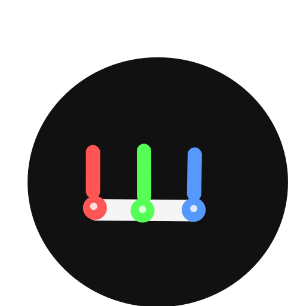
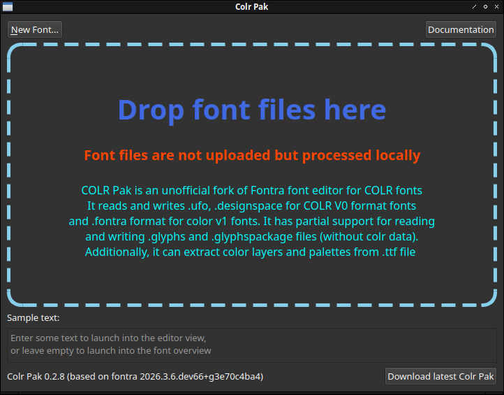

# Color Pak

<p align="center">
  
</p>

<p align="center">
  A standalone desktop font editor for authoring <strong>COLRv0 and COLRv1 color fonts</strong> — built on <a href="https://github.com/mitradranirban/fontra/tree/fontra-color-support">Fontra</a> with first-class color support.
</p>

<p align="center">
  <a href="https://github.com/mitradranirban/colr-pak/releases/latest">
    
  </a>
  
  
</p>

---

## What is Color Pak?

**Color Pak** is a cross-platform desktop application for designing and editing color fonts. It is a fork of [Fontra Pak](https://github.com/fontra/fontra-pak), extended with dedicated tooling for COLRv0 and COLRv1 color font authoring — including a visual paint graph editor, palette management, and gradient handles directly on the canvas.

Your fonts stay entirely on your computer and are never uploaded anywhere.

---

## Key Features

- **COLRv1 Paint Graph Editor** — visually compose `PaintSolid`, `PaintLinearGradient`, `PaintRadialGradient`, `PaintSweepGradient`, `PaintGlyph`, `PaintTranslate`, `PaintScale`, `PaintRotate`, `PaintSkew`, and `PaintTransform` nodes per glyph.
- **COLRv0 Layer Mapping** — manage color layer stacks with palette index assignments for simpler color fonts.
- **One-click COLRv0 → COLRv1 Upgrade** — automatically convert an existing v0 layer mapping into an equivalent COLRv1 `PaintColrLayers` structure.
- **Masterless COLRv1 Variation (WIP)** — author variable color parameters (gradient stops, transform values, alpha) as independent per-axis keyframes, without requiring separate outline masters.
- **Live Canvas Rendering** — see COLRv1 paint effects rendered in real time on the glyph canvas as you edit.
- **Palette Management** — define and switch between multiple color palettes; the active palette is reflected immediately in the canvas preview.
- **Full Fontra Editing Core** — all standard Fontra editing features (glyph drawing, variable font axes, anchors, components, etc.) are included.

---

## Supported File Formats

| Format | Read | Write |ColorV0|ColorV1|
|---|:---:|:---:|:---:|:---:|
| `.fontra` | ✅ | ✅ |-| ✅ |
| `.ufo` | ✅ | ✅ |✅ | - |
| `.designspace` | ✅ | ✅ |✅ | - |
| `.rcjk` | ✅ | ✅ | - | - |
| `.glyphs` / `.glyphspackage` | ✅ | ✅ (partial) | - | - |
| `.ttf` / `.otf` | ✅ | ✅ (via compile) |  ✅ | ✅ |
| `.woff` / `.woff2` | ✅ | — |- | - |
| `.ttx` | ✅ | — | - | - |

---

## Installation

Download the latest release for your platform from the [Releases page](https://github.com/mitradranirban/colr-pak/releases/latest):

 Read [Installation instruction](INSTALLATION.md)
No installation of Python or any other dependency is required — Color Pak ships as a self-contained binary.

---

## Building from Source

### Prerequisites

- Python 3.11+
- `pip`
- `PyInstaller`

### Steps

```bash
# 1. Clone this repository
git clone https://github.com/mitradranirban/colr-pak
cd colr-pak

# 2. Create and activate a virtual environment
python -m venv venv
source venv/bin/activate   # Windows: venv\Scripts\activate

# 3. Install dependencies (pulls color-support forks of fontra and fontra-compile)
pip install -r requirements.txt

# 4. Build the binary
pyinstaller FontraPak.spec
```

The output binary will be placed in `dist/Color Pak/` (macOS/Windows) or `dist/colorpak` (Linux).

---

## Architecture & Color Support

Color Pak is powered by two forked packages on the `fontra-color-support` branch:

| Package | Fork |
|---|---|
| `fontra` | [`mitradranirban/fontra@fontra-color-support`](https://github.com/mitradranirban/fontra/tree/fontra-color-support) |
| `fontra-compile` | [`mitradranirban/fontra-compile@fontra-color-support`](https://github.com/mitradranirban/fontra-compile/tree/fontra-color-support) |

### COLRv1 Data Model

COLRv1 paint data is stored in each glyph layer's `customData` under the key `colorv1`, as a JSON paint graph tree. This format is intended to be authored exclusively through Color Pak's visual paint graph editor — direct hand-editing of the JSON is not recommended, as the structure is tightly coupled to the editor's internal representation.


For variable color fonts, the colorv1 paint graph is stored per variation layer (e.g., a layer named `COLOR=100` for a `COLOR` axis at value `100`). Each variation layer carries its own full paint graph with the axis-specific parameter values (gradient coordinates, transform values, alpha, etc.). At compile time, `fontra-compile` reads the `colorv1` blocks across all variation layers and synthesizes a masterless variation — meaning color parameters vary independently along design axes without requiring separate outline masters. The compiled font uses COLRv1's `ItemVariationStore` to encode the per-parameter deltas.


This separation — variation data in named layers, masterless output from the compiler — keeps the `.fontra` source editable per-axis in Color Pak while producing a fully spec-compliant variable COLRv1 font on export.

---

## Usage

1. **Open a font** — drag and drop a font file onto the window, or use `New Font…` to start from scratch.
2. **Select a glyph** — click into any glyph in the font overview.
3. **Open the Color Layers panel** — use the panel sidebar to add COLRv0 color layers or build a COLRv1 paint graph.
4. **Edit paint nodes** — adjust parameters (palette index, gradient coordinates, transform values) directly in the panel form.
5. **Preview** — the canvas renders your COLRv1 paint in real time using the active palette.
6. **Export** — use `File > Export As…` to compile to `.ttf` or `.otf`, or save to any supported source format.

---

## Relationship to Fontra

Color Pak is a downstream fork of [Fontra Pak](https://github.com/fontra/fontra-pak) and [Fontra](https://github.com/fontra/fontra). All core editing functionality is inherited from the upstream Fontra project. Color Pak adds the COLRv1/COLRv0 authoring layer on top and will periodically merge upstream improvements.

Contributions to the upstream project that are not color-specific should ideally be made there first.

---

## License

Color Pak inherits the GPL3 license of the Fontra project. See [LICENSE](LICENSE) for details.

Original Fontra © Google LLC, Just van Rossum.
Color Pak extensions 🄯 [contributors of this fork](CONTRIBUTORS).

---

## Links

- [Colr Pak documentation](https://fonts.atipra.in/colrpak.html)
- [COLRv1 specification overview](https://simoncozens.github.io/colrv1-rocks/)
- [Upstream Fontra Pak](https://github.com/fontra/fontra-pak)
- [Upstream Fontra](https://github.com/fontra/fontra)
